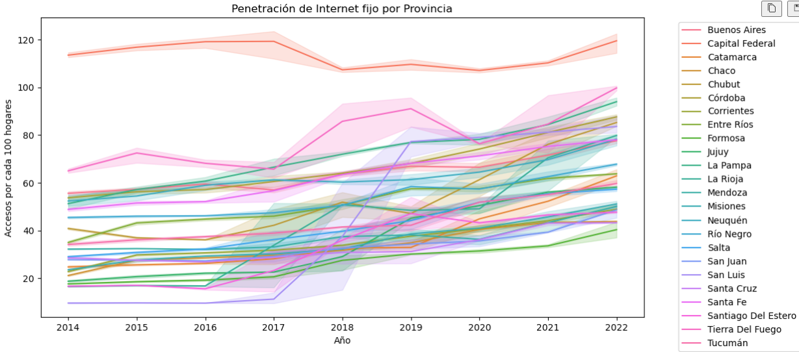
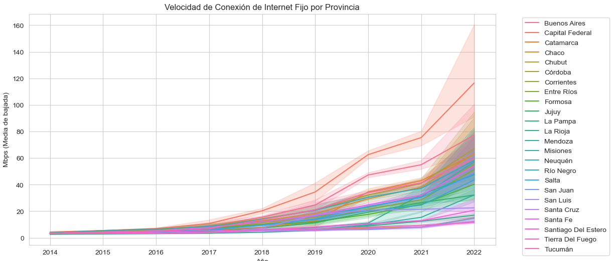
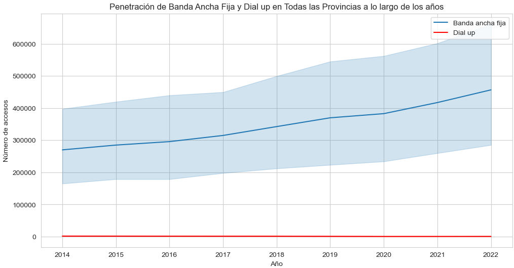
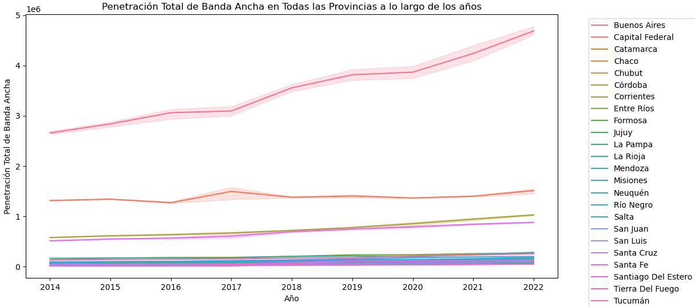
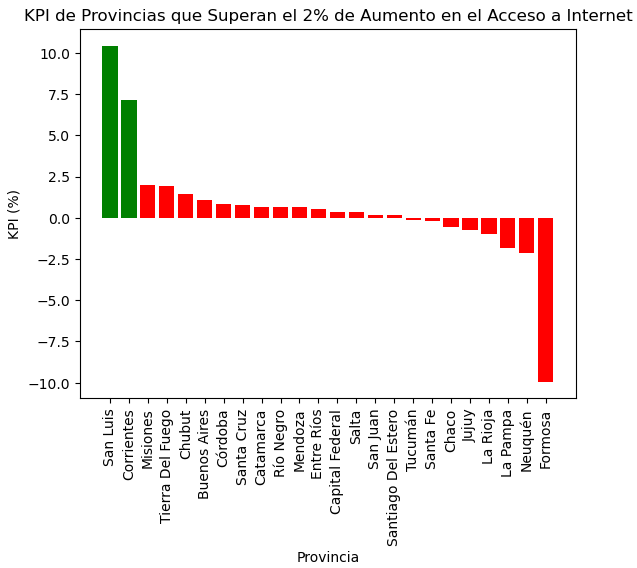
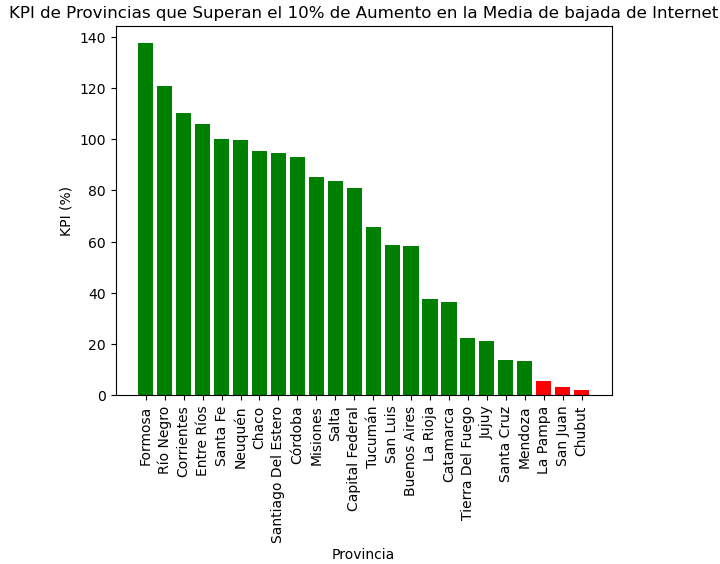

# Proyecto-Telecomunicaciones

## Descripción del Proyecto
En este escenario, nos enfocamos en la industria de las telecomunicaciones en Argentina y la necesidad de comprender y analizar su comportamiento a nivel nacional. El rol a desarrollar es el de un Data Analyst que trabaja para una empresa de telecomunicaciones. La empresa se especializa en brindar acceso a Internet, pero también busca comprender el comportamiento de otros servicios de comunicación para mejorar la calidad de sus servicios y ofrecer soluciones personalizadas.

## Librerías Utilizadas
Para llevar a cabo el análisis de los datos, se utilizaron las siguientes librerías de Python:
- pandas
- numpy
- matplotlib.pyplot
- seaborn

## **ETL**

En el notebook [ETL](https://github.com/CarlosHadla/Proyecto-Telecomunicaciones-Carlos-Hadla/blob/main/ETLySeleccionDeDatos.ipynb), se observa la importación de los dataset y se empieza a hacer una limpieza.

**1. Objetivos:**

- Limpeza y corrección de nombres, tipos de dato, datos vacios.  
- Visualizar la naturaleza de los dataset y las relaciones entre estos.
- Seleccionar los datos a usar en el EDA según las relaciones encontradas.

**2. Selección y relaciones:** 

- Se separaron los dataframes en 3 categorias: 'na' (Nación), 'prov' (Provincia) y 'loc' (Localidad).
- Se relacionó los datos según años y trimestres.
- Se seleccionaron los datos de 'Nación' y 'Provincia' para realizar el EDA, ya que los dataframes categorizados como 'Localidad' no tienen datos de tiempo.
- Se retiro el dataframe 'prov_dis_accesos_todo_vel_bajada', ya que 'prov_dis_accesos_rango_vel_bajada' contiene los mismos datos agrupados en rangos y abarca todos los años visualizados(2014-2022).

## Datos del EDA
### Carga de los Datos
#### Nacional
- `na_accesos_cada_100_hogares_fijo`
- `na_accesos_b_ancha_angosta_fijo`
- `na_accesos_tipo_tecnologia_fijo`
- `na_velocidad_media_bajada`
- `na_dis_accesos_rango_vel_bajada`
- `na_ingresos_operadores_fijo`

#### Provincial
- `prov_accesos_cada_100_hogares_fijo`
- `prov_velocidad_media_bajada`
- `prov_accesos_tipo_tecnologia_fijo`
- `prov_accesos_b_ancha_angosta_fijo`
- `prov_dis_accesos_rango_vel_bajada`
- `prov_dis_accesos_todo_vel_bajada`

### Resumen del EDA
#### Nacional
- Los datos a nivel nacional cuentan con 36 observaciones y no tienen valores faltantes observables.
- Los datos están agrupados en 4 trimestres por año, abarcando desde 2014 hasta 2018.

#### Provincial
- Los datos a nivel provincial cuentan con 864 observaciones, excepto `prov_dis_accesos_todo_vel_bajada`, que cuenta con 504 observaciones.
- Los datos están agrupados en 4 trimestres por año, abarcando desde 2014 hasta 2018.

#### Localidad
- No se utilizarán los datos que contienen localidades, ya que no tienen fechas, horas o trimestres que sirvan como referencia.
- Se observa que todas las tablas tienen diferencias en la cantidad de datos, lo que indica discrepancias en las tablas de localidades.

## Comenzando el Análisis
El análisis de los datos comienza con la exploración de estadísticas descriptivas de los principales conjuntos de datos. A continuación, se presentan algunos de los hallazgos clave basados en los análisis realizados.

### Accesos por Cada 100 Hogares en Provincias
Se analizó la penetración de Internet fijo en las provincias argentinas, calculando el promedio y la variabilidad en la penetración. Se realizaron visualizaciones que representan la distribución de accesos y el crecimiento a lo largo de los años.

### Velocidad de Conexión de Internet Fijo
Se examinó la velocidad de conexión de Internet fijo en las provincias, destacando las diferencias en la velocidad de bajada. Se utilizaron gráficos de líneas para ilustrar la evolución de la velocidad de bajada a lo largo del tiempo.

### Accesos por Tipo de Tecnología en Provincias
Se analizó la distribución de accesos por tipo de tecnología en las provincias y se crearon gráficos de barras para visualizar el crecimiento en el acceso a Internet por provincia.

### Accesos de Banda Ancha Fija
Se exploraron los datos de accesos de banda ancha fija y se calcularon estadísticas descriptivas. Se utilizó un gráfico de línea para comparar la penetración de banda ancha fija y dial-up en todas las provincias a lo largo de los años.

### Penetración Total de Banda Ancha
Se analizó la penetración total de banda ancha en todas las provincias a lo largo de los años. Se utilizaron gráficos de líneas y gráficos de barras para visualizar estos datos.

## KPIs (Indicadores Clave de Rendimiento)
### KPI de Aumento en Acceso a Internet
En el contexto de este estudio, se utiliza un KPI específico para evaluar el acceso a Internet en cada provincia. El KPI tiene como objetivo medir y monitorear el aumento en el acceso al servicio de Internet para el próximo trimestre, tomando como referencia cada 100 hogares en una provincia.

#### Fórmula del KPI
KPI = (("Nuevo acceso" - "Acceso actual") / "Acceso actual") * 100

Se realizaron cálculos del KPI para determinar qué provincias superaron el objetivo del 2% de aumento en el acceso a Internet. Se generaron visualizaciones que resaltan las provincias que cumplieron con el KPI y las que enfrentan desafíos en este aspecto.

### KPI de Mejora de Velocidad de Internet Fijo
Este KPI mide la mejora o disminución en la velocidad media de bajada de la conexión a Internet fijo entre dos periodos, generalmente trimestres consecutivos. El objetivo es alcanzar un aumento del 10% en la velocidad de bajada con respecto al periodo anterior.

#### Fórmula del KPI
KPI = ((Velocidad Media de Bajada Actual - Velocidad Media de Bajada Anterior) / Velocidad Media de Bajada Anterior) * 100

Se calcularon los KPIs de mejora de velocidad de Internet fijo para cada provincia y se crearon visualizaciones que destacan las diferencias en la mejora entre las provincias.

## Resultados de los KPIs
Los resultados de los KPIs proporcionan información valiosa sobre el acceso a Internet y la calidad de los servicios de telecomunicaciones en Argentina. A continuación, se presentan algunas conclusiones clave basadas en los resultados de los KPIs:

### KPI de Aumento en Acceso a Internet
- Solo dos provincias, San Luis y Corrientes, lograron superar el objetivo del 2% de aumento en el acceso a Internet.
- La mayoría de las provincias no cumplieron con el KPI, lo que resalta la necesidad de abordar desafíos en términos de acceso a Internet en la mayoría de las regiones.

### KPI de Mejora de Velocidad de Internet Fijo
- Todos los valores del KPI son positivos, indicando un aumento en la velocidad de bajada en todas las provincias.
- Se observa una amplia variabilidad en la mejora de la velocidad de bajada entre las provincias, con algunas provincias experimentando aumentos significativos y otras mostrando progresos más moderados.

## Conclusiones
El análisis de los KPIs arrojó luz sobre el estado de los servicios de telecomunicaciones en Argentina. La identificación de provincias que han superado los objetivos y aquellas que enfrentan desafíos es fundamental para guiar las estrategias de mejora en la industria de las telecomunicaciones. Estos resultados pueden ser útiles para la toma de decisiones y el desarrollo de soluciones que impulsen la calidad de los servicios de telecomunicaciones en todo el país.

## Autor
[Carlos Hadla](https://github.com/CarlosHadla)

¡Gracias por visitar este repositorio!
